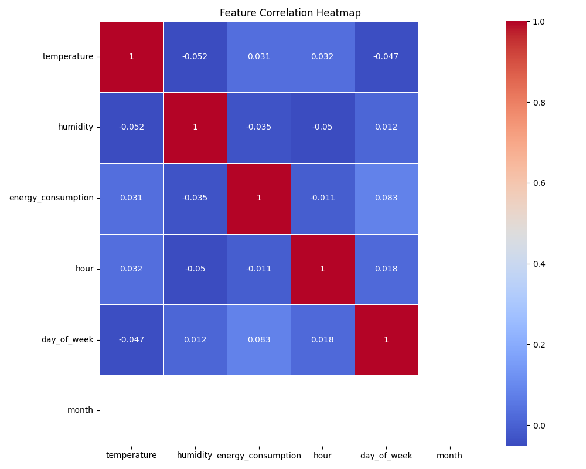
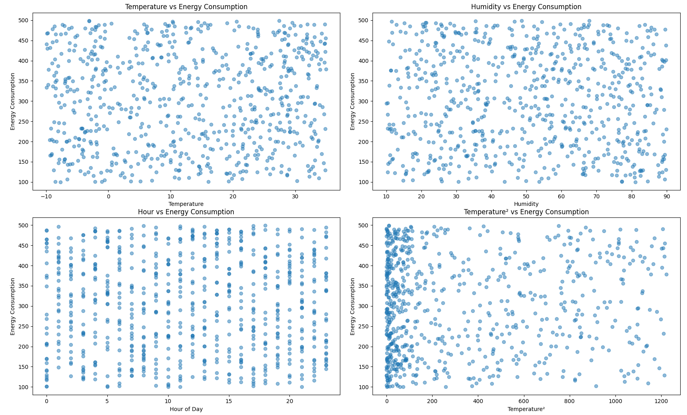
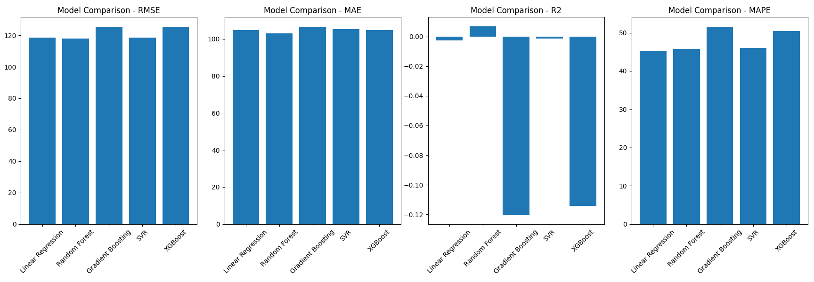

# Energy Consumption Prediction

## Introduction

This project aims to predict energy consumption for a commercial building using historical data that includes timestamp, outdoor temperature, outdoor humidity, and energy consumption readings. The goal is to preprocess the data, create useful features, build and evaluate machine learning models, and select the best performing model.

## Data Preprocessing and Exploration

1. Loaded the dataset using Pandas and performed basic exploratory data analysis.
2. Checked for missing values - no missing data was found.
3. Visualized relationships between features using a correlation heatmap and scatter plots:
   
   - Temperature showed the strongest positive correlation with energy consumption.
   - Humidity had a slight negative correlation with energy consumption.
   
   - Scatter plots revealed non-linear relationships, especially between temperature/temperature² and energy consumption.
4. Created additional features through feature engineering:
   - Extracted time-based features like hour, day of week, month, day of year from the timestamp
   - Created lagged features for temperature and humidity to capture recent historical values
   - Added interaction feature between temperature and humidity
   - Created polynomial features for temperature and humidity
   - Added binary feature for peak/off-peak hours
  
## Model Building 

1. Split the data chronologically into training (80%) and testing (20%) sets to prevent data leakage.
2. Trained multiple machine learning models:
   - Linear Regression
   - Random Forest
   - Gradient Boosting
   - Support Vector Regression (SVR)
   - XGBoost
3. Used pipelines to streamline the model training process, including custom transformers for temporal feature engineering.
4. Evaluated model performance using multiple metrics:
   - Mean Squared Error (MSE)
   - Root Mean Squared Error (RMSE) 
   - Mean Absolute Error (MAE)
   - R² Score
   - Mean Absolute Percentage Error (MAPE)

## Model Evaluation and Selection

Based on the evaluation metrics, the Random Forest model performed the best overall, with the lowest MSE, RMSE, MAE, and the highest R² score among all models.

Model Rankings:
1. Random Forest (MSE: 13923.7550, RMSE: 117.9990, MAE: 102.9804, R2: 0.0067, MAPE: 45.7501)
2. Linear Regression (MSE: 14054.8920, RMSE: 118.5533, MAE: 104.7091, R2: -0.0026, MAPE: 45.1809)
3. SVR (MSE: 14039.1730, RMSE: 118.4870, MAE: 105.2686, R2: -0.0015, MAPE: 46.0454)
4. XGBoost (MSE: 15618.0477, RMSE: 124.9722, MAE: 104.9143, R2: -0.1141, MAPE: 50.4098)
5. Gradient Boosting (MSE: 15702.6614, RMSE: 125.3103, MAE: 106.5272, R2: -0.1202, MAPE: 51.4981)

## Future Improvements

With more data, there are several potential areas for improvement:

1. Collect and incorporate additional relevant data, such as occupancy levels, equipment usage, or building characteristics, to enhance the predictive power of the models.

2. Experiment with more advanced feature engineering techniques, such as creating features based on energy consumption patterns or external factors like holidays and weather events.

3. Perform hyperparameter tuning using techniques like grid search or random search to optimize model performance.

4. Explore deep learning models like LSTMs that can capture long-term temporal dependencies in the data.

5. Implement more robust cross-validation strategies, such as time series cross-validation, to better assess model generalization.

In summary, this project demonstrates an end-to-end machine learning workflow for predicting energy consumption using historical data. The Random Forest model emerged as the top performer, but the overall poor performance of all models suggests that more relevant data and advanced techniques are needed to improve the accuracy of energy consumption predictions.